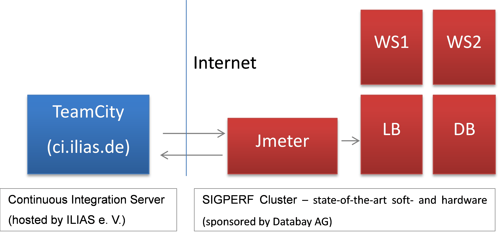

# ILIAS Performance Monitoring

The ILIAS Continuous Integration server [ci.ilias.de](http://ci.ilias.de) triggers nightly performance measurements of the ILIAS trunk branch.

* The CI server determines the GIT revision to test ..
* .. and updates the ILIAS installation before each run
  * git pull
  * database updates
  * language updates
* The CI server resets the database and data directory of the test system to a predefined state
* Measurements are performed for PHP5 and PHP7 individually
* The CI server fetches the measurement data and generates reports

Read more: [How to access the ILIAS Performance Monitoring](https://www.ilias.de/docu/goto_docu_wiki_wpage_4391_3063.html).

## Monitoring Setup

### The CI server [ci.ilias.de](http://ci.ilias.de)

* is running teamcity
* connects with the test system via SSH

### The test system [sigperf.iliasnet.de](https://sigperf.iliasnet.de)

Software stack
* Ubuntu
* PHP 7.x + PHP 5.x
* MariaDB
* Nginx
* Apache
* jMeter
* [ILIAS performance testsuite](https://github.com/qualitus/performance-tests)
* and some helper script for updating ILIAS:
  http://svnext.databay.de/scm/git/PerfTestsuiteHelper

ILIAS **trunk** installations
* [Public client](https://sigperf_trunk.iliasnet.de/index.php?client_id=SIGPERF-TRUNK)
* [Template client](https://sigperf_trunk.iliasnet.de/index.php?client_id=SIGPERF-TRUNK-CI-TPL) for CI measurements
* [Temporary working client](https://sigperf_trunk.iliasnet.de/index.php?client_id=SIGPERF-TRUNK-CI-TMP) for CI measurements

Note: There is also another ILIAS installation, which is not updated automatically and also has a public client: https://sigperf.iliasnet.de (latest stable release / **not trunk**).

# Questions?

If you have any question, please feel free to file an [issue](https://github.com/qualitus/performance-tests/issues).